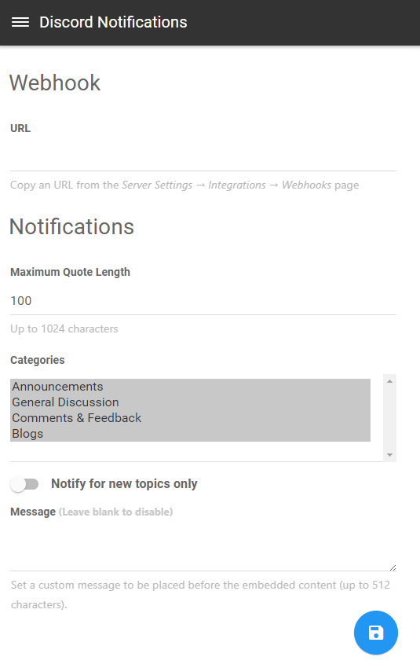

# Discord Notifications for NodeBB

 

Send notifications of new posts and topics via [Discord](https://discordapp.com/) webhook.

It’s like [NodeBB Slack](https://github.com/pichalite/nodebb-plugin-slack-extended) plugin, but for Discord. Fancy rich embeds included.

## Configuration

1. Install the plugin and activate it.
2. Create a Discord webhook (Server Settings &rarr; Webhooks).  
    You’ll get an URL like `https://discordapp.com/api/webhooks/<Webhook ID>/<Webhook Token>`.
3. Fill in **ID** and **Token** fields on the plugin settings page.
4. Restart NodeBB.

## Screenshot

