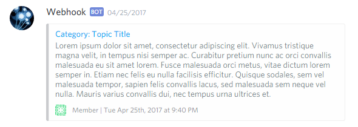

# Discord Notifications for NodeBB

  

Send notifications of new posts and topics via [Discord](https://discord.com/) webhook.

It’s like [NodeBB Slack](https://github.com/pichalite/nodebb-plugin-slack-extended) plugin, but for Discord. Fancy rich embeds included.

## Configuration

1. Install the plugin and activate it.
2. Create a Discord webhook (Server Settings &rarr; Integrations).  
    You’ll get an URL like `https://discord.com/api/webhooks/<Webhook ID>/<Webhook Token>`.
3. Fill in **Webhook URL** field on the plugin settings page.
4. Restart NodeBB.

## Customization

The border color of an embedded post excerpt depends on a background color of its category.

The **Message** field is optional and blank by default.  
Fill it in to set a custom short text to be placed before the embedded content.

For example, you can add some mentions as on the screenshot below.  
Use `@here` or `@everyone` as usual or type `<@UserID>` to mention a member, `<@&RoleID>` to mention a role and `<#ChannelID>` for a channel reference.

To get the IDs, enable Developer Mode (Discord App Settings &rarr; Appearance), right click a user or a channel and select *Copy ID*. The other way is to add a backslash to mentions in the chat (i.e `\@User`, `\@Role` or `\#Channel`).

## Screenshots

### Notification

### ACP UI

